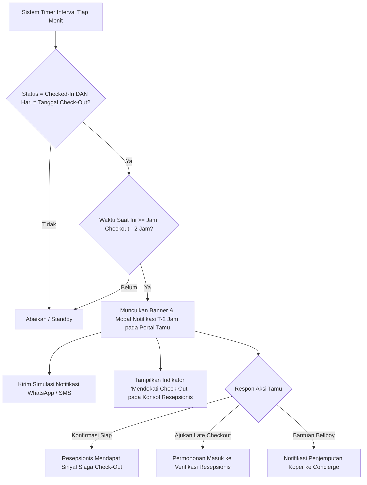

# Product Requirements Document (PRD)
## HotelKu Yogyakarta — Sistem Manajemen & Reservasi Hotel

| Metadata | Keterangan |
| :--- | :--- |
| **Versi Dokumen** | 1.3 (Revisi Fokus: 3 Peran Pengguna) |
| **Tanggal Pembaruan** | 13 September 2026 |
| **Status** | Final Draft — Penambahan Fitur Pengingat Check-Out Otomatis (*T-2 Jam*) & Notifikasi Kamar Siap Check-In |
| **Referensi Produk (Deploy)** | [hotel-project-five-peach.vercel.app](https://hotel-project-five-peach.vercel.app) |
| **Penyusun** | Tim Pengembang HotelKu Yogyakarta |

---

## 1. Latar Belakang

**HotelKu Yogyakarta** adalah aplikasi web prototipe manajemen hotel (tugas akhir pengembangan prototipe aplikasi) yang melayani pemesanan kamar secara daring (*online*) dengan tiga peran pengguna utama: **Tamu**, **Resepsionis**, dan **Admin**. Aplikasi mengusung tema akomodasi mewah bernuansa etnik Jawa klasik dengan 6 kategori kamar (*Standard Room*, *Superior Room*, *Deluxe Room*, *Junior Suite*, *Executive Suite*, dan *Presidential Suite*).

Dalam operasional perhotelan, efisiensi pelayanan tamu pada saat kedatangan (*check-in*) dan kepulangan (*check-out*) memegang peranan paling krusial terhadap kepuasan pelanggan. Dua permasalahan utama yang sering terjadi di lapangan adalah:
1. **Keterlambatan check-out tanpa pemberitahuan (*unnotified late check-out*):** Tamu seringkali lupa batas waktu kepulangan pukul 12:00 WIB, sehingga proses serah terima kamar terhambat.
2. **Ketidakpastian kesiapan kamar bagi tamu (*uncertain room readiness*):** Tamu yang datang lebih awal atau sedang menunggu di lobi seringkali tidak mengetahui apakah kamar sudah siap huni, sehingga berulang kali mendatangi meja resepsionis dan memicu antrean panjang.

Dokumen ini merumuskan spesifikasi produk yang mencakup fitur-fitur inti pemesanan kamar hotel serta fitur bernilai tambah berupa **Sistem Pengingat Check-Out Otomatis (T-2 Jam)**, **Notifikasi Kamar Siap Check-In (Room Ready Notification)**, serta **Dashboard Okupansi & Pendapatan Real-Time**.

---

## 2. Tujuan Produk

- **Bagi Tamu (Guest):** 
  - Menyediakan platform reservasi kamar hotel *end-to-end* yang praktis, cepat, dan transparan.
  - Memberikan notifikasi pengingat ramah 2 jam sebelum batas waktu check-out agar tamu tidak lupa, dapat berkemas santai, dan memiliki tombol aksi cepat untuk mengajukan perpanjangan (*late check-out*) atau meminta bantuan barang (*luggage assistance*).
  - Memberikan notifikasi real-time saat kamar sudah selesai disiapkan dan siap huni (*Room Ready Notification*), sehingga tamu dapat langsung melakukan check-in tanpa perlu mengantre atau bolak-balik bertanya di lobi.
- **Bagi Resepsionis (Front Desk):** 
  - Mempercepat proses verifikasi check-in dan check-out tamu secara digital tanpa pencatatan kertas manual.
  - Memberikan visibilitas daftar kamar yang mendekati batas check-out (< 2 jam) guna koordinasi kepulangan tamu yang lebih terencana.
  - Memantau denah status kamar secara real-time (*Occupied, Available/Ready, Reserved*).
- **Bagi Administrator & Manajemen Hotel:** 
  - Mengelola inventaris katalog kamar, penyesuaian tarif harga, dan manajemen akun pengguna.
  - Memberikan *Business Intelligence* berupa grafik okupansi kamar, tren pemesanan, dan laporan pendapatan harian secara real-time.

---

## 3. Peran Pengguna (Roles)

| Peran (Role) | Deskripsi & Hak Akses Utama |
| :--- | :--- |
| **Tamu (Guest)** | Mencari dan memesan kamar, melihat tiket/voucher pesanan pada menu 'Pesanan Saya', mengelola profil akun, menerima pengingat check-in/out, serta mengajukan permohonan *late check-out*. |
| **Resepsionis (Front Desk)** | Memverifikasi reservasi masuk, memproses transaksi kedatangan (*Check-In*) dan kepulangan (*Check-Out*), memantau kamar mendekati batas check-out, serta merespons permohonan bantuan tamu. |
| **Administrator (Admin)** | Mengelola inventaris kamar (harga, tipe, fasilitas, foto), mengelola data pengguna hotel, memantau metrik performa okupansi, dan laporan finansial bisnis. |

---

## 4. Rangkuman Fitur Eksisting

1. **Landing Page & Beranda:**
   - Showcase fasilitas unggulan (Infinity Pool, Javanese Spa, Warung Tradisional, Fitness Center, 24/7 Concierge, Airport Transfer).
   - Widget jam digital dan penanggalan real-time (hari, tanggal, bulan, tahun, jam WIB).
   - Bar pencarian cepat ketersediaan kamar (*check-in/check-out date*, jumlah tamu, jumlah unit).
2. **Katalog Kamar Interaktif (`/rooms`):**
   - Daftar kamar lengkap dengan filter tipe, harga per malam, fasilitas spesifik, galeri foto, dan tombol reservasi instan.
3. **Autentikasi & Akun Demo Multi-Role:**
   - Sistem registrasi mandiri untuk tamu baru dengan validasi email *case-insensitive*.
   - Tombol login akun demo 1-klik untuk Admin, Resepsionis, dan Tamu.
4. **Portal Tamu (`/my-reservations` & `/profile`):**
   - Riwayat pesanan aktif dan lampau beserta status pemesanan (*Pending*, *Approved*, *Checked-In*, *Checked-Out*, *Rejected*).
   - Cetak e-voucher reservasi kamar.
5. **Admin Console (`/admin/dashboard`):**
   - KPI metrik finansial, tingkat okupansi hunian, manajemen kamar (`/admin/rooms`), dan manajemen pengguna (`/admin/users`).
6. **Konsol Resepsionis (`/receptionist/dashboard`):**
   - Dashboard operasional harian front office, konfirmasi reservasi masuk, dan alur cepat transaksi *Check-In* dan *Check-Out*.

---

## 5. Fitur Bernilai Tambah 1: Pengingat Check-Out Otomatis (T-2 Jam)

### 5.1 Latar Belakang & Masalah
Tamu seringkali terlambat melakukan check-out (melebihi standar pukul 12:00 WIB) karena lupa waktu, tertidur, atau terburu-buru berkemas. Hal ini memicu penumpukan antrean di front office dan mengacaukan kesiapan kamar untuk tamu yang akan datang pada pukul 14:00 WIB.

### 5.2 Mekanisme & Logika Pemicu (*Trigger Logic*)
- **Waktu Pemicu:** Tepat **2 jam (120 menit)** sebelum batas waktu check-out resmi:
  $$T_{\text{trigger}} = T_{\text{checkout}} - 120\text{ menit}$$
  *(Contoh: Pada jadwal checkout pukul 12:00 WIB, notifikasi otomatis aktif pukul 10:00 WIB pada hari kepulangan).*
- **Kondisi Validasi:**
  - Status reservasi saat ini = `checked-in`.
  - Tanggal hari ini = Tanggal `check_out` pada data reservasi.
  - Tamu belum memproses kepulangan di meja resepsionis.

### 5.3 Kanal Penyampaian & Tampilan Antarmuka

#### A. Banner & Dialog Interaktif pada Portal Tamu (`/my-reservations` & Akun Tamu)
Saat tamu membuka aplikasi web, muncul banner notifikasi elegan bernuansa emas-oranye:
> **✦ PENGINGAT WAKTU CHECK-OUT ✦**  
> *"Selamat pagi Bpk/Ibu [Nama Tamu], waktu check-out untuk Kamar [Nomor/Tipe Kamar] adalah hari ini pukul **12:00 WIB** (tersisa 2 jam lagi). Mohon persiapkan barang bawaan Anda agar kepulangan berjalan lancar."*

#### B. Menu Aksi Cepat (*Quick Actions*) untuk Tamu:
1. `[Konfirmasi Siap Check-Out Pukul 12:00]`:
   - Mengabari sistem front desk bahwa tamu siap checkout tepat waktu.
2. `[Ajukan Late Check-Out (Perpanjangan Waktu)]`:
   - Membuka form permohonan (+1 Jam s.d. 13:00 WIB atau +2 Jam s.d. 14:00 WIB) yang diteruskan ke resepsionis untuk disetujui/ditolak berdasarkan ketersediaan kamar.
3. `[Panggil Bantuan Bellboy / Angkut Koper]`:
   - Meminta staf concierge menjemput koper di kamar tamu.

#### C. Visibilitas pada Konsol Resepsionis (`/receptionist/dashboard`):
- Tab khusus: **"Mendekati Batas Check-Out (< 2 Jam)"**.
- Kamar yang berada dalam periode T-2 jam ditandai dengan badge kuning: `[Segera Check-Out - 10:00 s.d. 12:00]`.
- Resepsionis dapat memantau apakah tamu sudah mengonfirmasi kepulangan atau meminta perpanjangan waktu.

---

## 6. Fitur Bernilai Tambah 2: Notifikasi Kamar Siap Check-In (Room Ready Notification)

### 6.1 Latar Belakang & Masalah
Tamu yang tiba lebih awal (*early arrival*) sebelum jam standar check-in (14:00 WIB), atau tamu yang sedang bersantai di kafe/lobi hotel, seringkali tidak mengetahui apakah kamar yang mereka pesan sudah selesai disiapkan atau belum. Hal ini menyebabkan tamu harus berulang kali mendatangi meja resepsionis untuk bertanya (*"Apakah kamar saya sudah siap?"*), menimbulkan penumpukan antrean di lobi dan memecah konsentrasi petugas resepsionis.

### 6.2 Cara Kerja & Fitur:
1. **Pemicu Kesiapan Kamar (*Room Ready Trigger*):**
   - Saat status kamar telah diverifikasi siap huni (*Ready/Available*) oleh sistem atau resepsionis pada hari kedatangan tamu:
   - Sistem secara otomatis memicu notifikasi instan ke portal tamu (`/my-reservations`) dengan pesan: *"Kamar [Nomor/Tipe Kamar] Anda Sudah Siap! Anda dapat langsung menuju meja resepsionis untuk mengambil kunci kamar tanpa perlu mengantre."*
   - Dilengkapi simulasi pengiriman notifikasi pesan instan (WhatsApp / SMS push).
2. **Hak Akses Masuk Lebih Awal (*Early Check-In Privilege*):**
   - Jika kamar siap lebih awal dari pukul 14:00 WIB (misalnya pukul 12:30 atau 13:15 WIB), tamu langsung memperoleh notifikasi hak masuk lebih awal tanpa biaya tambahan, menciptakan impresi pertama (*first impression*) yang sangat menyenangkan bagi tamu.
3. **Papan Monitoring Kesiapan pada Konsol Resepsionis:**
   - Resepsionis dapat melihat daftar kamar yang berstatus *Ready for Check-In* dan status bahwa tamu telah diberi tahu (*Guest Notified*).
   - Saat tamu tiba di meja resepsionis, proses verifikasi identitas dan serah terima kunci kamar dapat diselesaikan dalam waktu kurang dari 1 menit.

---

## 7. Fitur Bernilai Tambah 3: Dashboard Okupansi & Pendapatan Real-Time

### 7.1 Latar Belakang & Masalah
Manajemen hotel dan resepsionis membutuhkan visibilitas instan atas tingkat keterisian kamar dan perolehan pendapatan harian tanpa harus menghitung rekapitulasi buku kas secara manual.

### 7.2 Cara Kerja & Fitur:
1. **Kalkulasi Otomatis KPI Tingkat Okupansi:**
   $$\text{Tingkat Okupansi (\%)} = \left( \frac{\text{Jumlah Kamar Dihuni (Occupied)}}{\text{Total Unit Kamar Tersedia}} \right) \times 100\%$$
2. **Rekapitulasi Finansial Terwujud vs Potensial:**
   - Menghitung pendapatan terwujud dari tamu yang sudah *Checked-In* dan *Checked-Out*.
   - Menghitung estimasi potensi omzet dari reservasi yang berstatus *Approved/Pending*.
3. **Denah Warna Status Kamar Real-Time:**
   - *Biru:* Dihuni Tamu (*Occupied*).
   - *Kuning:* Mendekati Batas Check-Out (*Approaching Check-Out*).
   - *Hijau:* Siap Dipesan / Kosong (*Available*).
4. **Sinkronisasi Jam Digital Operasional WIB:**
   - Mengintegrasikan penanggalan lengkap (Hari, Tanggal, Bulan, Tahun, dan Jam berdetik real-time) sebagai acuan baku jam check-in/out.

---

## 8. Matriks User Stories

| ID | Sebagai | Saya ingin | Agar |
| :---: | :--- | :--- | :--- |
| **US-01** | Tamu Hotel | Melihat ketersediaan tipe kamar, foto, fasilitas, dan harga per malam secara transparan | Dapat memilih kamar yang paling sesuai dengan kebutuhan menginap. |
| **US-02** | Tamu Hotel | Melakukan reservasi dan mendapatkan e-voucher booking secara instan | Memiliki kepastian hak kamar sebelum tiba di hotel. |
| **US-03** | **Tamu Hotel** | **Menerima notifikasi pengingat ramah 2 jam sebelum batas check-out (pukul 10:00 WIB)** | **Memiliki cukup waktu untuk mengemas barang bawaan dan terhindar dari denda keterlambatan.** |
| **US-04** | **Tamu Hotel** | **Dapat mengajukan permohonan Late Check-Out atau memanggil bellboy langsung dari ponsel** | **Proses kepulangan menjadi lebih fleksibel, nyaman, dan bebas ribet.** |
| **US-05** | Resepsionis | Memproses verifikasi check-in dan check-out tamu secara cepat berbasis pencarian nama/ID | Mengurangi waktu tunggu tamu di meja lobi. |
| **US-06** | **Resepsionis** | **Melihat daftar kamar yang mendekati batas check-out (< 2 jam) beserta status konfirmasi tamu** | **Dapat mengantisipasi kepulangan tamu dan memantau perputaran kamar secara proaktif.** |
| **US-07** | **Tamu Hotel** | **Menerima notifikasi instan saat kamar sudah selesai disiapkan dan siap huni** | **Dapat langsung mengambil kunci kamar di lobi tanpa harus menunggu atau bolak-balik bertanya ke resepsionis.** |
| **US-08** | Administrator | Menambah, mengedit tarif harga, dan memperbarui foto kamar | Mengelola inventaris hotel secara mandiri. |
| **US-09** | Administrator | Memantau grafik okupansi kamar dan rekapitulasi pendapatan harian secara real-time | Dapat mengevaluasi performa bisnis hotel dan menentukan strategi promosi. |

---

## 9. Aturan Bisnis & Penanganan Skenario Khusus (*Edge Cases*)

| Skenario | Logika & Perilaku Sistem |
| :--- | :--- |
| **Tamu telah check-out lebih awal (misal pukul 09:30 WIB)** | Status reservasi langsung beralih ke `checked-out`. Notifikasi pengingat T-2 jam otomatis dibatalkan/tidak dikirimkan (*suppressed*). |
| **Tamu mengajukan Late Check-Out dan disetujui resepsionis** | Jam batas check-out pada reservasi diperbarui (misal menjadi 13:30 WIB). Sistem menghitung ulang waktu pengingat dan memperbarui catatan operasional front desk. |
| **Tamu melewati batas check-out tanpa konfirmasi (pukul 12:15 WIB)** | Sistem menandai reservasi dengan status `Overdue Check-Out` berwarna merah di konsol resepsionis, memberi tanda bagi front desk untuk mengonfirmasi via telepon internal kamar. |
| **Tamu membatalkan reservasi** | Status reservasi berubah menjadi `rejected` / `cancelled`, unit kamar otomatis kembali ke status *Available*. |
| **Perubahan harga kamar oleh Admin** | Perubahan tarif hanya berlaku untuk pemesanan baru; reservasi yang telah dibuat sebelumnya tetap menggunakan tarif saat pemesanan disepakati. |

---

## 10. Metrik Keberhasilan (*Success Metrics*)

1. **Penurunan Keterlambatan Check-Out:** Penurunan insiden *late check-out* tanpa konfirmasi sebesar $\ge 40\%$.
2. **Efisiensi Waktu Pelayanan Front Desk:** Waktu pemrosesan check-in dan check-out per tamu turun dari rata-rata 6 menit menjadi $< 2$ menit.
3. **Pengurangan Antrean di Lobi:** Penurunan antrean dan waktu tunggu tamu yang menanyakan kesiapan kamar sebesar $\ge 35\%$.
4. **Kepuasan Pengalaman Tamu (*Guest Rating*):** Ulasan positif tamu terhadap kemudahan reservasi dan kepastian kesiapan kamar mencapai $\ge 4.8 / 5.0$.

---

## 11. Batasan Ruang Lingkup (Scope)

### In Scope:
- Sistem reservasi daring berbasis web dengan tema etnik Jawa mewah (*Standard, Superior, Deluxe, Suite, Presidential*).
- 3 Peran Pengguna: Tamu, Resepsionis, dan Administrator.
- Alur Check-In dan Check-Out digital pada konsol resepsionis.
- **Sistem Pengingat Check-Out Otomatis (T-2 Jam)** pada portal tamu dan indikator di konsol resepsionis.
- **Notifikasi Kamar Siap Check-In (*Room Ready Notification*)** pada portal tamu.
- Menu aksi cepat tamu (*Konfirmasi Siap Check-Out*, *Ajukan Late Check-Out*, *Panggil Bellboy*).
- Dashboard okupansi, status ketersediaan kamar, dan metrik pendapatan real-time.
- Jam digital dan penanggalan terpadu (Hari, Tanggal, Bulan, Tahun, Jam WIB).

### Out of Scope (Sengaja Dibatasi):
- Modul manajemen tugas kebersihan internal housekeeping (dikecualikan dari fokus skripsi).
- Integrasi sensor hardware IoT kamar (saklar kartu pintar / sensor pintu).
- Integrasi payment gateway perbankan komersial nyata yang membutuhkan perizinan merchant (menggunakan virtual billing).
- Integrasi channel manager ke platform OTA pihak ketiga (Traveloka/Agoda/Booking.com).
