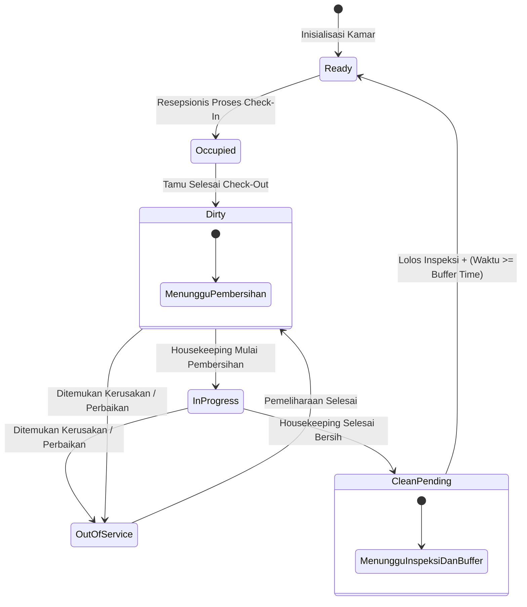

# Product Requirements Document (PRD)
## HotelKu Yogyakarta — Sistem Manajemen & Reservasi Hotel

| Metadata | Keterangan |
| :--- | :--- |
| **Versi Dokumen** | 1.1 |
| **Tanggal Pembaruan** | 13 September 2026 |
| **Status** | Draft — Penambahan Fitur Prioritas Pembersihan Kamar (*Housekeeping Priority Queue*) |
| **Referensi Produk (Deploy)** | [hotel-project-five-peach.vercel.app](https://hotel-project-five-peach.vercel.app) |
| **Penyusun** | Tim Pengembang HotelKu Yogyakarta |

---

## 1. Latar Belakang

**HotelKu Yogyakarta** adalah aplikasi web prototipe manajemen hotel (tugas akhir pengembangan prototipe aplikasi) yang melayani pemesanan kamar secara daring (*online*) dengan tiga peran pengguna utama: **Tamu**, **Resepsionis**, dan **Admin**. Aplikasi mengusung tema akomodasi mewah bernuansa etnik Jawa klasik dengan 6 kategori kamar (*Standard Room*, *Superior Room*, *Deluxe Room*, *Junior Suite*, *Executive Suite*, dan *Presidential Suite*).

Saat ini alur operasional kamar (checkout → dibersihkan → siap dihuni kembali) belum memiliki mekanisme validasi otomatis. Hal ini berisiko menimbulkan kasus di mana kamar yang **belum selesai dibersihkan** tetap dapat di-*assign* atau di-*check-in*-kan ke tamu baru oleh resepsionis, terutama pada saat tingkat okupansi tinggi karena status kamar tidak menyesuaikan proses housekeeping secara real-time.

Dokumen ini mencakup:
1. Rangkuman fitur produk yang sudah ada (*existing features*).
2. Spesifikasi lengkap fitur baru: **Prioritas & Buffer Waktu Pembersihan Kamar (*Housekeeping Priority Queue & Minimum Buffer Time*)**.

---

## 2. Tujuan Produk

- **Bagi Tamu:** Menyediakan platform reservasi kamar hotel *end-to-end* yang andal (pencarian, pemesanan, konfirmasi pembayaran, riwayat pesanan, profil pengguna).
- **Bagi Resepsionis:** Menyediakan konsol operasional *front desk* terintegrasi (layanan check-in/check-out, monitoring status kamar, pencatatan tamu).
- **Bagi Admin:** Menyediakan konsol administratif eksekutif (manajemen data kamar, harga dinamis, manajemen pengguna & peran, laporan pendapatan serta okupansi).
- **(Fitur Baru) Bagi Operasional & Housekeeping:** Mencegah kamar yang belum bersih atau belum lolos inspeksi ter-*assign* ke tamu yang akan check-in, melalui sistem antrian prioritas tugas kebersihan dan penerapan jeda waktu (*buffer time*) minimum pasca-checkout.

---

## 3. Peran Pengguna (Roles)

| Peran (Role) | Deskripsi & Hak Akses |
| :--- | :--- |
| **Tamu (Guest)** | Mencari kamar berdasarkan tanggal dan preferensi, membuat reservasi baru, melihat riwayat pemesanan (*booking voucher*), mengelola profil akun. |
| **Resepsionis (Front Desk)** | Memvalidasi reservasi tamu, memproses transaksi *Check-In* dan *Check-Out*, melihat denah status kamar secara real-time. |
| **Administrator (Admin)** | Mengelola inventaris kamar (harga, tipe, fasilitas), manajemen akun dan hak akses pengguna, mengakses laporan keuangan & KPI bisnis hotel. |
| **Housekeeping (Baru)** | Menerima daftar tugas pembersihan kamar terurut berdasarkan prioritas urgensi, memperbarui tahapan kebersihan kamar, melaporkan isu pemeliharaan (*maintenance*). |

---

## 4. Rangkuman Fitur Eksisting

1. **Landing Page & Beranda:**
   - Showcase fasilitas unggulan (Infinity Pool, Javanese Spa, Warung Tradisional, Fitness Center, 24/7 Concierge, Airport Transfer).
   - Widget jam digital dan penanggalan real-time (hari, tanggal, bulan, tahun, jam WIB).
   - Bar pencarian cepat kamar (*check-in/check-out date*, tamu, kamar).
2. **Katalog Kamar (`/rooms`):**
   - Daftar kamar interaktif dengan filter kategori (*Standard*, *Superior*, *Deluxe*, *Suite*, *Presidential*), harga per malam, galeri foto, dan fasilitas detail.
   - Pilihan pemesanan instan dengan form booking otomatis.
3. **Autentikasi & Otorisasi Pengguna:**
   - Sistem registrasi mandiri akun tamu baru dan login aman dengan validasi *case-insensitive* email.
   - Akun demo cepat untuk pengujian per peran (Admin, Resepsionis, Tamu).
   - Opsi *social login mockup* (Google / Facebook).
4. **Portal Tamu (`/my-reservations` & `/profile`):**
   - Riwayat pesanan aktif dan lampau beserta status persetujuan (*Pending*, *Approved*, *Checked-In*, *Checked-Out*, *Rejected*).
   - Cetak / unduh detail voucher reservasi.
5. **Admin Console (`/admin/dashboard`):**
   - KPI metrik finansial, tingkat okupansi hunian, dan rekapitulasi bisnis.
   - Manajemen kamar (`/admin/rooms`), pengguna (`/admin/users`), dan pengaturan banner promo (`/admin/settings`).
6. **Konsol Resepsionis (`/receptionist/dashboard`):**
   - Dashboard operasional harian, konfirmasi reservasi masuk, serta alur cepat *Check-In* dan *Check-Out*.
   - Denah visual monitoring kebersihan & status hunian kamar (`/receptionist/rooms-status`).

---

## 5. Fitur Baru: Prioritas & Buffer Waktu Pembersihan Kamar

### 5.1 Latar Belakang Masalah
Setelah tamu melakukan checkout, kamar hotel berada dalam kondisi kotor dan membutuhkan proses pembersihan, penggantian linen, serta penataan ulang perlengkapan (*amenities*). Tanpa adanya validasi sistem yang mengikat:
- Resepsionis berpotensi meng-*assign* kamar yang belum bersih kepada tamu berikutnya yang datang lebih awal (*early check-in*).
- Status kebersihan dapat diubah manual terlalu tergesa-gesa tanpa memperhatikan standar durasi pembersihan minimum.
- Tidak ada panduan sistematis bagi staf housekeeping mengenai kamar mana yang harus didahulukan saat beberapa kamar checkout secara bersamaan (*peak checkout hours*).

### 5.2 Tujuan Fitur
- **Memblokir Aksi Check-In Sebelum Kamar "Ready":** Sistem secara teknis mengunci tombol check-in jika status kamar belum berstatus **"Ready / Siap Dihuni"**.
- **Antrian Cerdas (*Priority Queue*):** Mengurutkan kamar yang kotor berdasarkan tingkat kedekatan waktu kedatangan tamu berikutnya.
- **Penerapan Buffer Time Minimum:** Mencegah manipulasi status instan dengan mengharuskan jeda waktu pembersihan minimum yang realistis.
- **Peringatan Dini (*Early Warning Alert*):** Memberikan sinyal waspada kepada resepsionis jika terdapat tamu yang akan check-in dalam waktu < 60 menit namun kamar terkait masih belum siap.

---

### 5.3 Siklus Status Kamar (*Room Status Lifecycle*)

#### Definisi Status:

| Status | Kode Warna | Keterangan | Valid untuk Check-In? |
| :--- | :---: | :--- | :---: |
| **Occupied** | Biru | Sedang dihuni oleh tamu yang aktif. | ❌ Tidak |
| **Dirty (Kotor)** | Merah | Tamu telah checkout; kamar kotor dan menunggu dibersihkan. | ❌ Tidak (Terkunci) |
| **In Progress** | Kuning / Oranye | Staf housekeeping sedang aktif membersihkan unit kamar. | ❌ Tidak (Terkunci) |
| **Clean - Pending Inspection** | Oranye Muda | Pembersihan selesai dilakukan, menunggu inspeksi supervisor & pemenuhan buffer time. | ❌ Tidak (Terkunci) |
| **Ready (Siap Dihuni)** | Hijau | Kamar bersih, telah diinspeksi, dan buffer time terpenuhi. | ✅ **Ya (Hanya status ini)** |
| **Out of Service** | Abu-abu Gelap | Kamar sedang dalam perbaikan fisik/fasilitas (*maintenance*). | ❌ Tidak |

---

### 5.4 Buffer Waktu Minimum (*Minimum Buffer Time*)

1. **Parameter Buffer Time:**
   - Nilai standar (*default*): **45 menit**.
   - Dapat dikonfigurasi secara mandiri oleh Admin per tipe kamar (misal: *Presidential Suite* = 90 menit, *Standard Room* = 35 menit).
2. **Kalkulasi Waktu:**
   - Waktu dihitung sejak **stempel waktu (*timestamp*) checkout aktual** dicatat di sistem, bukan dari saat housekeeping menekan tombol.
3. **Aturan Transisi ke "Ready":**
   Kamar hanya dapat beralih ke status **Ready** apabila memenuhi dua kondisi simultan:
   $$\text{Durasi Berlalu} = (\text{Waktu Saat Ini} - \text{Waktu Checkout}) \ge \text{Buffer Time}$$
   **DAN** staf housekeeping/supervisor telah menandai kamar selesai dibersihkan dan lulus inspeksi.
4. **Estimasi Sisa Waktu:**
   Jika housekeeping menandai selesai sebelum batas buffer berakhir, sistem mempertahankan status **Clean - Pending Inspection** dan menampilkan *countdown timer* waktu buffer yang tersisa.
5. **Override Administratif:**
   Admin berhak melakukan override darurat manual dengan mewajibkan pengisian catatan alasan resmi, yang secara otomatis dicatat pada *Audit Log*.

---

### 5.5 Algoritma Antrian Prioritas Housekeeping (*Housekeeping Priority Queue*)

Daftar kamar kotor (*Dirty*) diurutkan secara dinamis menggunakan aturan pembobotan:

1. **Prioritas 1 (Urgensi Kedatangan Terdekat):** Kamar yang memiliki reservasi terkonfirmasi dengan jadwal check-in pada hari yang sama diurutkan dari jam kedatangan paling awal.
2. **Prioritas 2 (*Back-to-Back Booking*):** Kamar dengan jeda waktu antara checkout tamu sebelumnya dan check-in tamu berikutnya $\le 3$ jam mendapatkan badge khusus: `[URGENT: BACK-TO-BACK]`.
3. **Prioritas 3 (Kompleksitas Tipe Kamar):** Tipe kamar dengan estimasi waktu pembersihan lebih lama (Suite & Presidential Suite) diprioritaskan lebih awal agar tidak menimbulkan keterlambatan.
4. **Prioritas 4 (*FIFO - First In, First Out*):** Waktu checkout paling lama dijadikan penentu jika parameter jadwal check-in tamu berikutnya sama.

---

### 5.6 Kebutuhan Antarmuka Pengguna (UI Requirements)

#### A. Konsol Housekeeping (Halaman Baru):
- Tampilan kartu/tabel tugas terurut berdasarkan prioritas urgensi.
- Tombol aksi satu-klik: `[Mulai Bersihkan]` $\rightarrow$ `[Selesai Dibersihkan]`.
- Tombol eskalasi cepat: `[Lapor Perbaikan / Out of Service]`.
- Indikator hitung mundur waktu buffer (*live buffer countdown timer*).
- Filter per lantai (*Floor 1 - 5*) dan tipe kamar.

#### B. Konsol Resepsionis (Pembaruan Halaman):
- Penegakan teknis: Tombol `Proses Check-In` pada reservasi dinonaktifkan (*disabled*) dengan tooltip: `"Kamar masih dalam proses pembersihan (Status: Dirty / In Progress)"`.
- Banner peringatan dini di dashboard resepsionis:
  > *"⚠ Perhatian: Tamu Bpk. Bambang akan check-in dalam 40 menit, namun Kamar 302 masih berstatus Dirty."*
- Opsi cepat resepsionis: Relokasi ke kamar lain bertipe sama yang berstatus *Ready*.

#### C. Konsol Admin (Pembaruan Halaman):
- Menu konfigurasi durasi buffer per tipe kamar (input menit).
- Riwayat catatan audit override (*Audit Log Viewer*).
- Statistik performa: Rata-rata durasi pembersihan aktual tim housekeeping vs target buffer.

---

### 5.7 User Stories

| ID | Sebagai | Saya ingin | Agar |
| :---: | :--- | :--- | :--- |
| **US-01** | Staf Housekeeping | Melihat daftar kamar kotor yang terurut berdasarkan jam check-in tamu berikutnya | Dapat mendahulukan kamar yang paling mendesak tanpa perlu bertanya berulang kali ke resepsionis. |
| **US-02** | Resepsionis | Dilarang oleh sistem saat mencoba check-in ke kamar yang belum berstatus *Ready* | Tidak ada insiden memalukan tamu memasuki kamar yang masih berantakan. |
| **US-03** | Resepsionis | Menerima peringatan otomatis jika ada kamar tamu yang belum siap dalam waktu < 60 menit sebelum check-in | Dapat segera menyiapkan kamar pengganti atau memberikan fasilitas *welcome lounge* kepada tamu. |
| **US-04** | Administrator | Menetapkan durasi buffer pembersihan berbeda untuk masing-masing tipe kamar | Estimasi waktu pembersihan akurat sesuai dengan ukuran dan kompleksitas kamar. |
| **US-05** | Tamu Hotel | Mendapatkan kamar yang bersih, higienis, dan lolos inspeksi tepat waktu | Pengalaman menginap di HotelKu Yogyakarta menjadi nyaman dan berkesan. |

---

### 5.8 Aturan Bisnis & Penanganan Skenario Khusus (*Edge Cases*)

| Skenario | Logika & Perilaku Sistem |
| :--- | :--- |
| **Tamu datang sebelum jam check-in standar (*Early Check-In*)** | Jika kamar yang dipesan masih *Dirty*, resepsionis diberikan opsi: (a) Menawarkan pemindahan ke kamar sejenis yang *Ready*, atau (b) Mengaktifkan notifikasi SMS/WhatsApp/Panggilan saat kamar siap. |
| **Housekeeping selesai lebih cepat dari durasi buffer** | Status tetap berada di *Clean - Pending Inspection*. Tombol check-in tetap terkunci hingga waktu buffer tercapai untuk menjamin ventilasi udara dan sanitasi kamar optimal. |
| **Ditemukan kerusakan sarana saat pembersihan** | Housekeeping menekan tombol "Lapor Kerusakan". Status otomatis beralih ke *Out of Service*, kamar dikeluarkan dari antrian check-in, dan resepsionis diberi notifikasi untuk merelokasi tamu. |
| **Checkout terlambat (*Late Checkout*)** | Timer buffer otomatis dihitung ulang sejak jam checkout aktual yang tercatat pada tombol *Proses Check-out*, bukan dari jam checkout reguler (12:00 WIB). |
| **Override darurat oleh Administrator** | Hanya akun berwenang Admin yang dapat membuka kunci kamar sebelum buffer selesai. Wajib mencantumkan alasan (misal: "Kamar hanya digunakan 1 jam / inspeksi darurat GM") yang tersimpan permanen di basis data. |

---

### 5.9 Metrik Keberhasilan (*Success Metrics*)

1. **Nol Kasus Kesalahan Check-In:** $0\%$ insiden penyerahan kunci kamar kotor kepada tamu pasca-rilis fitur.
2. **Penurunan Waktu Tunggu Tamu:** Pengurangan waktu tunggu tamu pada saat *peak check-in hours* (14:00 - 16:00 WIB) sebesar $\ge 25\%$.
3. **Akurasi Realisasi Pembersihan:** Deviasi waktu pembersihan aktual staf housekeeping tidak melebihi $\pm 10$ menit dari parameter buffer time yang ditetapkan.

---

## 6. Kebutuhan Non-Fungsional (Non-Functional Requirements)

- **Sinkronisasi Real-Time:** Perubahan status kamar harus terdistribusi secara cepat (< 1 detik) ke seluruh layar resepsionis dan housekeeping.
- **Responsivitas Layar Seluler (*Mobile-First UI*):** Tampilan housekeeping harus optimal digunakan pada smartphone dengan tata letak tombol ramah sentuhan (*touch-friendly*).
- **Keamanan Data & Jejak Audit:** Seluruh mutasi status kamar mencatat data: `room_id`, `previous_status`, `new_status`, `changed_by_user_id`, `timestamp`, dan `notes`.

---

## 7. Asumsi & Pertanyaan Terbuka (*Open Questions*)

1. **Akses Akun Housekeeping:**
   - *Rekomendasi:* Disediakan akun khusus dengan role `housekeeping` (misal: `housekeeping@hotelku.com` / `housekeeper123`) yang hanya memiliki akses ke tampilan antrian kebersihan dan status kamar.
2. **Kanal Notifikasi Peringatan Dini:**
   - Untuk fase prototipe saat ini, notifikasi diprioritaskan berupa kartu peringatan interaktif dan badge audio/visual pada konsol resepsionis.
3. **Nilai Default Buffer Time:**
   - Standar 45 menit disepakati sebagai acuan umum industri perhotelan bintang 4 dan 5 di wilayah Yogyakarta.

---

## 8. Batasan di Luar Ruang Lingkup (*Out of Scope*)

- Integrasi perangkat keras IoT kamar (sensor gerak PIR atau saklar kartu cerdas).
- Penjadwalan giliran kerja (*shift roster*) dan pembagian upah staf kebersihan secara otomatis.
- Pelacakan inventaris kimia pembersih dan stok linen secara terperinci.
