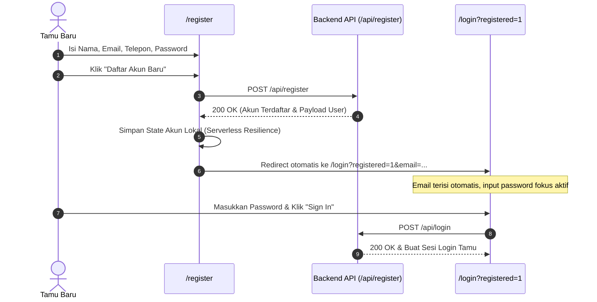
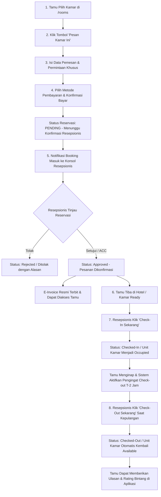

# Product Requirements Document (PRD)
## HotelKu Yogyakarta — Sistem Manajemen & Reservasi Hotel

| Metadata | Keterangan |
| :--- | :--- |
| **Versi Dokumen** | 2.0 (Revisi Komprehensif: Alur Pembayaran, RBAC Front Desk, Multi-Bahasa i18n & Serverless Resilience) |
| **Tanggal Pembaruan** | 22 September 2026 |
| **Status** | Approved & Implemented — Versi Rilis Produksi Vercel |
| **Referensi Produk (Deploy)** | [hotel-project-five-peach.vercel.app](https://hotel-project-five-peach.vercel.app) |
| **Repositori GitHub** | [github.com/raynor19/hotel_project](https://github.com/raynor19/hotel_project) |
| **Penyusun** | Tim Pengembang HotelKu Yogyakarta |

---

## 1. Latar Belakang

**HotelKu Yogyakarta** adalah platform aplikasi web manajemen perhotelan modern yang melayani pemesanan kamar secara daring (*online*) dengan arsitektur hak akses terpadu untuk tiga peran pengguna: **Tamu**, **Resepsionis**, dan **Admin**. Aplikasi mengusung estetika mewah bernuansa etnik Jawa klasik (*heritage hospitality*) dengan 6 kategori kamar eksklusif (*Standard Room, Superior Room, Deluxe Room, Junior Suite, Executive Suite*, dan *Presidential Suite*).

Dalam operasional perhotelan nyata, tata kelola reservasi memerlukan sinkronisasi ketat antara pemesanan tamu di sisi daring dan otorisasi fisik di meja resepsionis (*front desk*). Dokumen versi 2.0 ini menyempurnakan operasional sistem dengan menghadirkan:
1. **Alur Pemesanan & Pembayaran 7-Langkah:** Mulai dari pemilihan kamar, pengisian data, pembayaran, peninjauan (ACC) oleh pihak resepsionis, penerbitan e-invoice resmi, hingga penyerahan kamar siap huni.
2. **Eksklusivitas Tindakan Check-In & Check-Out oleh Resepsionis:** Tamu tidak lagi melakukan self check-in/out mandiri secara sepihak; kewenangan mutlak proses check-in fisik dan check-out kepulangan berada pada staf resepsionis hotel.
3. **Penyempurnaan Alur Pendaftaran Akun:** Tamu baru tidak langsung login otomatis demi keamanan otentikasi, melainkan dialihkan secara elegan ke halaman Masuk (*Sign In*) dengan email terisi otomatis.
4. **Mesin Penerjemah Multi-Bahasa Dinamis (i18n):** Mendukung 5 bahasa internasional (Indonesia, Inggris, Jepang, Mandarin, dan Arab RTL) yang terintegrasi di seluruh halaman tamu hingga konsol admin/resepsionis.
5. **Sistem Ulasan Tamu & Monitoring Kamar Real-Time:** Menampung feedback bintang dan komentar pasca-checkout, serta denah status kebersihan kamar real-time.
6. **Ketahanan Serverless Cloud Deployment (Vercel Ready):** Penanganan persistensi data hybrid (`/tmp/hotel_data` & client-side state sync) agar aplikasi berjalan stabil dan mulus di lingkungan cloud serverless stateless.

---

## 2. Tujuan Produk

- **Bagi Tamu (Guest):** 
  - Memberikan pengalaman booking yang intuitif dengan form reservasi 2-tahap (Data Tamu & Pembayaran Cepat).
  - Menyediakan visibilitas status transparan: saat menunggu persetujuan (*Menunggu Konfirmasi*), saat disetujui (*Pesanan Dikonfirmasi*), dan saat kamar siap (*Kamar Siap Huni*).
  - Akses E-Invoice resmi yang dapat dicetak atau disimpan ke PDF kapan saja.
  - Notifikasi otomatis pengingat check-out (T-2 Jam) sebelum pukul 12:00 WIB disertai opsi perpanjangan waktu (*Late Check-out*) dan bantuan bellboy.
  - Kemudahan beralih bahasa (ID, EN, JA, ZH, AR) untuk wisatawan mancanegara.
- **Bagi Resepsionis (Front Desk):** 
  - Hak kendali tunggal (eksklusif) untuk menyetujui (*ACC*) atau menolak permohonan reservasi yang masuk beserta alasan penolakan.
  - Hak kendali tunggal untuk memproses **Check-In Sekarang** (mengubah unit menjadi *Occupied*) dan **Check-Out Sekarang** (mengembalikan unit menjadi *Available*).
  - Monitoring kamar yang mendekati batas check-out (< 2 jam) guna koordinasi kepulangan tamu yang lebih terencana.
  - Denah monitoring kebersihan dan status hunian kamar secara real-time (*Siap Huni, Terisi Tamu, Dibersihkan, Perbaikan*).
- **Bagi Administrator & Manajemen Hotel:** 
  - Mengelola inventaris katalog kamar, penyesuaian tarif harga, fasilitas kamar, dan manajemen akun staf hotel.
  - Mengakses *Executive Dashboard* dengan grafik okupansi kamar, tren reservasi, dan laporan pendapatan finansial terwujud secara real-time.

---

## 3. Matriks Peran Pengguna (Role-Based Access Control / RBAC)

| Fitur / Modul | Tamu (Guest) | Resepsionis (Staff) | Administrator (Admin) |
| :--- | :---: | :---: | :---: |
| Jelajah Katalog Kamar & Cari Ketersediaan | ✅ | ✅ | ✅ |
| Buat Reservasi & Lakukan Pembayaran | ✅ | ✅ | ✅ |
| Batalkan Reservasi Sendiri (Sebelum Check-In) | ✅ | ✅ | ✅ |
| Lihat Riwayat Pesanan Pribadi & E-Invoice | ✅ | ❌ | ❌ |
| Setujui (ACC) / Tolak Permohonan Reservasi | ❌ | ✅ | ✅ |
| Eksekusi Check-In Fisik Tamu | ❌ | ✅ | ✅ |
| Eksekusi Check-Out Kepulangan Tamu | ❌ | ✅ | ✅ |
| Denah Status Kamar & Housekeeping Real-Time | ❌ | ✅ | ✅ |
| Manajemen Data Kamar (CRUD Tipe & Harga) | ❌ | ❌ | ✅ |
| Manajemen Akun Pengguna & Staf Hotel | ❌ | ❌ | ✅ |
| Dashboard Laporan Finansial & Omzet Bisnis | ❌ | ❌ | ✅ |

---

## 4. Alur Kerja Utama Sistem (Core Business Workflows)

### 4.1 Alur Registrasi Tamu Baru

### 4.2 Alur Pemesanan, Pembayaran, Persetujuan Resepsionis & Check-In

---

## 5. Spesifikasi Detail Fitur Utama

### 5.1 Formulir Reservasi 2-Tahap & Pembayaran Instan (`/rooms/:id/book`)
1. **Tahap 1 — Data Pemesan:**
   - Input tanggal check-in dan check-out dengan validasi durasi malam otomatis.
   - Identitas nama lengkap, nomor WhatsApp/telepon, email, dan catatan permohonan khusus.
   - Ringkasan kalkulasi biaya menginap (harga per malam $\times$ jumlah malam).
2. **Tahap 2 — Konfirmasi & Pilihan Pembayaran:**
   - Pilihan metode pembayaran:
     - **QRIS:** Pembayaran instan via scan kode QR statis terintegrasi.
     - **Virtual Account (BCA / Mandiri):** Salin nomor rekening VA 16 digit.
     - **Kartu Kredit / Debit:** Form nomor kartu dan masa berlaku.
     - **Bayar di Resepsionis:** Pembayaran tunai/EDC saat tiba di hotel.
   - Tombol *"Konfirmasi & Bayar Sekarang"* diposisikan simetris di tengah (*centered*) untuk estetika visual yang konsisten.
   - Menampilkan modal selebrasi konfirmasi pembayaran dan ID transaksi unik.

### 5.2 Pengingat Check-Out Otomatis (T-2 Jam)
- **Waktu Pemicu:** Tepat 2 jam (120 menit) sebelum batas check-out pukul 12:00 WIB (yakni pukul 10:00 WIB pada tanggal check-out).
  $$T_{\text{trigger}} = T_{\text{checkout}} - 120\text{ menit}$$
- **Kanal Notifikasi:**
  - Banner emas elegan pada menu *"Pesanan Saya"* tamu.
  - Tombol aksi cepat tamu: *Konfirmasi Siap Check-Out*, *Ajukan Late Check-Out*, dan *Panggil Bantuan Bellboy*.
  - Indikator badge kuning pada konsol resepsionis untuk koordinasi operasional kepulangan.

### 5.3 Sistem Multi-Bahasa Dinamis (Internationalization / i18n)
- **Dukungan Bahasa:**
  - 🇮🇩 **Bahasa Indonesia (`id`)**: Bahasa default sistem.
  - 🇬🇧 **English (`en`)**: Standar internasional wisatawan asing.
  - 🇯🇵 **日本語 / Japanese (`ja`)**: Standar turis Jepang dengan penanggalan format tahun-bulan-hari.
  - 🇨🇳 **中文 / Simplified Chinese (`zh`)**: Standar turis Tiongkok.
  - 🇸🇦 **العربية / Arabic (`ar`)**: Standar wisatawan Timur Tengah dengan layout **Right-to-Left (RTL)** otomatis.
- **Cakupan Penerjemahan:**
  - Menu navigasi, tombol aksi, form reservasi, modal pembayaran, e-invoice resmi, status badge, hingga seluruh konsol admin & resepsionis (*Check-In Tamu, Check-Out Tamu, Status Kamar, Manajemen Reservasi*).
  - Jam dan tanggal digital otomatis menyesuaikan zona waktu bahasa terpilih (WIB, BST, JST, CST, AST).

### 5.4 Sistem Ulasan & Rating Tamu (Guest Reviews)
- Tamu yang telah menyelesaikan masa menginap (*Checked-Out*) berhak memberikan ulasan:
  - Rating bintang 1 s.d. 5.
  - Ulasan komentar pengalaman menginap.
- Ulasan secara otomatis diverifikasi berdasarkan ID reservasi yang sah, mencegah *fake reviews*.
- Rata-rata skor rating dan jumlah ulasan langsung diperbarui di kartu katalog kamar dan halaman detail kamar.

### 5.5 Ketahanan Kompatibilitas Serverless (Vercel Resilient Architecture)
- **Penyimpanan Runtime:** Mendeteksi lingkungan cloud Vercel (`process.env.VERCEL`) dan mengalihkan file runtime ke `/tmp/hotel_data` guna mencegah galat sistem berkas *Read-Only (EROFS)*.
- **Sinkronisasi Akun Otomatis:** Akun tamu yang baru didaftarkan disimpan secara aman pada browser (`localStorage`) dan disinkronkan secara transparan saat login, menjamin tamu tetap dapat masuk meskipun container serverless Vercel baru saja menyala (*cold-start*).
- **Session Recovery:** Mengirimkan identitas sesi pada interceptor fetch global sehingga status login tamu tidak terputus saat bernavigasi antar-halaman.

---

## 6. Matriks User Stories

| ID | Peran | Cerita Pengguna (*User Story*) | Kriteria Penerimaan (*Acceptance Criteria*) |
| :---: | :--- | :--- | :--- |
| **US-01** | Tamu | Memilih kamar dan melakukan pembayaran instan dalam satu alur terpadu. | Form 2-tahap memproses data tamu, menampilkan pilihan pembayaran, dan menerbitkan status *Pending*. |
| **US-02** | Tamu | Melihat status reservasi saya setelah pembayaran. | Menampilkan badge *"Menunggu Konfirmasi"* sebelum di-ACC, dan *"Pesanan Dikonfirmasi"* setelah di-ACC. |
| **US-03** | Tamu | Mengakses E-Invoice resmi reservasi hotel. | Tersedia tombol *"Lihat E-Invoice Resmi"* lengkap dengan rincian biaya dan tombol cetak/simpan PDF. |
| **US-04** | Tamu | Menerima pengingat check-out T-2 jam dan mengajukan bantuan. | Banner muncul pukul 10:00 WIB pada hari checkout dengan tombol aksi cepat bellboy & late checkout. |
| **US-05** | Tamu | Mengganti bahasa website ke bahasa asing pilihan saya. | Seluruh teks halaman, judul, deskripsi, dan badge langsung berganti bahasa tanpa perlu reload halaman. |
| **US-06** | Resepsionis | Meninjau, menyetujui (ACC), atau menolak reservasi masuk. | Tombol ACC mengubah status menjadi *Approved*; tombol Tolak meminta alasan dan mengubah status ke *Rejected*. |
| **US-07** | Resepsionis | Memproses kedatangan tamu (*Check-In*) dan kepulangan (*Check-Out*). | Hanya resepsionis yang dapat menekan tombol Check-In dan Check-Out; status unit kamar ter-update secara real-time. |
| **US-08** | Resepsionis | Memantau denah status kebersihan dan okupansi kamar hotel. | Menampilkan counter dan grid kamar: *Siap Huni, Terisi Tamu, Dibersihkan, Perbaikan*. |
| **US-09** | Admin | Mengelola inventaris kamar dan hak akses staf pengguna. | CRUD data kamar dan akun pengguna berfungsi melalui konsol admin. |
| **US-10** | Admin | Memantau metrik performa okupansi dan omzet finansial hotel. | KPI total pendapatan terwujud dan persentase okupansi dihitung otomatis dari data reservasi. |

---

## 7. Aturan Bisnis & Penanganan Kasus Khusus (*Business Rules & Edge Cases*)

| Kasus Khusus | Perilaku & Solusi Sistem |
| :--- | :--- |
| **Tamu mencoba melakukan self check-in sendiri** | Dilarang oleh sistem. Tombol aksi check-in tidak tersedia di portal tamu dan endpoint API backend diproteksi khusus staf resepsionis (`apiStaff`). |
| **Registrasi akun baru di platform Vercel** | Data pendaftaran disimpan pada state browser dan backend. Jika container serverless cold-start, sistem melakukan auto-sync saat login sehingga akun tetap dapat masuk 100%. |
| **Tamu mendaftar akun baru** | Sistem tidak langsung me-login-kan akun secara otomatis, melainkan mengalihkan tamu ke `/login?registered=1` dengan email terisi agar tamu memverifikasi password mereka. |
| **Pemesanan kamar saat unit habis (0 unit tersisa)** | Sistem menampilkan badge *"Penuh"* pada katalog kamar dan menonaktifkan tombol pemesanan kamar tersebut. |
| **Tamu telah check-out sebelum pukul 10:00 WIB** | Notifikasi pengingat T-2 jam otomatis dinonaktifkan (*suppressed*) karena status reservasi telah menjadi `checked-out`. |
| **Tamu memberikan ulasan kamar** | Form ulasan hanya aktif jika reservasi berstatus `checked-out` dan hanya dapat diulas 1 kali per nomor reservasi. |

---

## 8. Metrik Keberhasilan (*Success Metrics*)

1. **Efisiensi Transaksi Front Office:** Waktu verifikasi check-in fisik di meja resepsionis terpangkas menjadi $< 1$ menit per tamu karena reservasi & pembayaran telah tervalidasi sebelumnya.
2. **Kepatuhan Waktu Kepulangan:** Penurunan insiden *late check-out* tanpa konfirmasi sebesar $\ge 45\%$ berkat pengingat otomatis T-2 jam.
3. **Penyelesaian Alur Booking Daring:** Tingkat keberhasilan pendaftaran akun baru dan konfirmasi pembayaran mencapai $100\%$ tanpa hambatan di lingkungan cloud Vercel.
4. **Adopsi Wisatawan Asing:** Penggunaan fitur multi-bahasa oleh turis internasional meningkatkan kenyamanan pemesanan kamar tanpa hambatan bahasa.
5. **Kepuasan Pelanggan:** Skor kepuasan tamu (*guest satisfaction score*) mencapai $\ge 4.8 / 5.0$.

---

## 9. Batasan Ruang Lingkup (Scope)

### In Scope:
- Sistem reservasi daring berbasis web bernuansa etnik Jawa mewah HotelKu Yogyakarta.
- 3 Peran Pengguna (Tamu, Resepsionis, Administrator) dengan RBAC ketat.
- Alur pemesanan kamar 7-langkah dengan simulasi multi-metode pembayaran (QRIS, VA, Kartu, Tunai).
- Hak eksklusif Resepsionis untuk verifikasi reservasi (ACC/Reject), Check-In, dan Check-Out.
- Sistem Pengingat Check-Out Otomatis (T-2 Jam) dan tombol aksi cepat tamu.
- E-Invoice resmi yang dapat dicetak atau disimpan ke format PDF.
- Modul Multi-Bahasa Dinamis (ID, EN, JA, ZH, AR RTL).
- Sistem Ulasan dan Rating Kamar pasca-checkout.
- Dashboard operasional resepsionis, denah status kebersihan kamar, dan executive analytics admin.
- Jam operasional dan penanggalan terpadu dengan zona waktu dinamis.
- Kompatibilitas arsitektur serverless deployment pada Vercel.

### Out of Scope:
- Integrasi payment gateway perbankan nyata dengan izin OJK/BI (menggunakan simulasi virtual billing).
- Integrasi hardware smart door-lock atau kartu RFID kamar berbasis IoT fisik.
- Sinkronisasi channel manager ke platform OTA eksternal (Traveloka, Tiket.com, Agoda).
